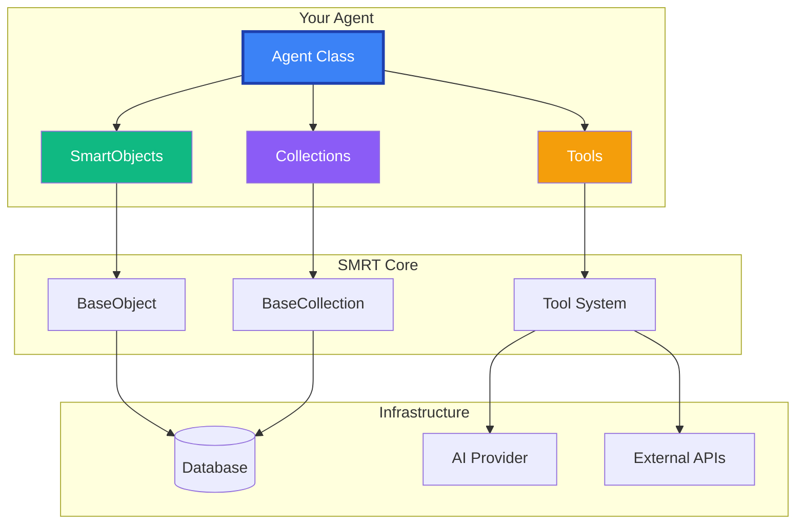
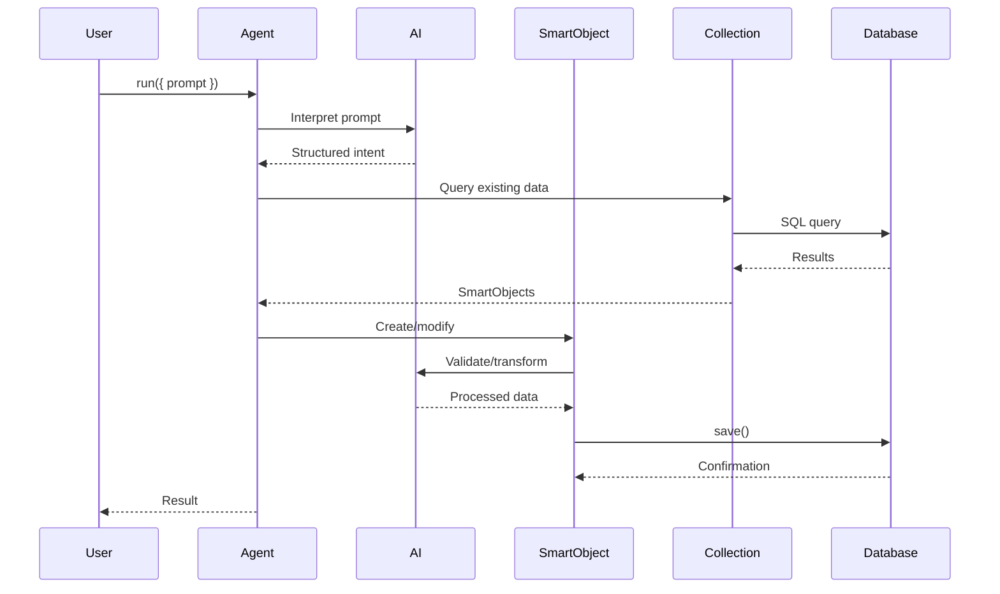

# The SMRT Framework Overview

The SMRT Agent Framework is architected around a simple but powerful concept: **intelligent agents need structure, memory, and perception to be effective**. This overview explains how SMRT's components work together to create sophisticated AI agents.

## Architecture at a Glance



## Core Components

### 1. The Agent

The `Agent` is the orchestrator—the brain that coordinates all operations:

```typescript
class Agent {
  constructor(options: {
    ai: AIClient;           // AI provider (OpenAI, Anthropic, etc.)
    name: string;           // Agent identifier
    description?: string;   // What this agent does
    tools?: Tool[];        // Available capabilities
  })

  // Primary execution method
  async run(options: {
    prompt: string;        // What to do
    context?: any;        // Additional context
    outputClass?: Class;  // Expected output structure
  }): Promise<any>
}
```

**Key Responsibilities:**
- Interprets prompts and determines actions
- Coordinates between AI, database, and tools
- Manages conversation context
- Handles errors and retries

### 2. SmartObjects: Structure

`SmartObjects` give agents a way to understand and work with structured data:

```typescript
class SmartObject extends BaseObject {
  // Automatic properties
  id: string;           // Unique identifier
  slug?: string;        // URL-friendly identifier
  created_at: Date;     // Creation timestamp
  updated_at: Date;     // Last modification

  // AI-powered methods
  async is(criteria: string): Promise<boolean>
  async do(instruction: string): Promise<string>

  // Persistence
  async save(): Promise<void>
  async delete(): Promise<void>

  // Lifecycle hooks
  async beforeSave(): Promise<void>
  async afterSave(): Promise<void>
}
```

**Why SmartObjects?**
- **Schema Generation**: Properties automatically create database schemas
- **AI Integration**: Built-in methods for AI-powered operations
- **Type Safety**: Full TypeScript support
- **Lifecycle Management**: Hooks for validation and transformation

### 3. Collections: Memory

`Collections` manage sets of SmartObjects and provide the agent's memory:

```typescript
class Collection<T extends SmartObject> {
  constructor(options: {
    itemClass: Class<T>;  // Type of objects
    ai?: AIClient;        // AI for intelligent operations
    db?: Database;        // Database connection
  })

  // CRUD operations
  async create(data: Partial<T>): Promise<T>
  async get(id: string): Promise<T | null>
  async list(query?: Query): Promise<T[]>
  async update(id: string, data: Partial<T>): Promise<T>
  async delete(id: string): Promise<boolean>

  // Advanced queries
  async search(query: string): Promise<T[]>
  async aggregate(pipeline: any[]): Promise<any>
}
```

**Key Features:**
- **Automatic Table Creation**: Based on SmartObject schema
- **Rich Query Language**: Filters, sorting, pagination
- **Batch Operations**: Efficient bulk processing
- **AI-Enhanced Search**: Semantic search capabilities

### 4. Tools: Perception

Tools give agents the ability to interact with the external world:

```typescript
interface Tool {
  name: string;
  description: string;
  execute(params: any): Promise<any>;
}

// Example: File System Tool
class FilesTool implements Tool {
  name = 'files';
  description = 'Read and write files';

  async execute({ action, path, content }) {
    switch(action) {
      case 'read': return fs.readFile(path);
      case 'write': return fs.writeFile(path, content);
      case 'list': return fs.readdir(path);
    }
  }
}
```

**Built-in Tool Categories:**
- **File System** (`@have/files`): File operations
- **Web** (`@have/spider`): Web scraping and content extraction
- **Documents** (`@have/pdf`): PDF processing
- **Database** (`@have/sql`): Direct SQL queries
- **Custom Tools**: Your own integrations

## How It All Works Together

### Example: Document Processing Agent

Let's see how components work together in a real scenario:

```typescript
// 1. Define Structure (SmartObject)
class Document extends SmartObject {
  title: string = '';
  content: string = '';
  source: string = '';
  summary?: string;
  extracted_data?: Record<string, any>;
}

// 2. Create Agent with Tools
const agent = new Agent({
  ai: await getAIClient({ provider: 'openai' }),
  name: 'DocumentProcessor',
  tools: [PDFTool, WebScraperTool]
});

// 3. Set up Memory (Collection)
const documents = new Collection<Document>({
  itemClass: Document,
  ai: agent.ai
});

// 4. Process Documents
async function processDocument(source: string) {
  // Agent determines the tool to use
  const content = await agent.run({
    prompt: `Extract content from ${source}`,
    tools: [PDFTool, WebScraperTool]
  });

  // Create structured document
  const doc = new Document({
    source,
    content,
    title: await agent.ai.message(`Extract title from: ${content}`),
    ai: agent.ai
  });

  // Generate summary using SmartObject capability
  doc.summary = await doc.do('Summarize this document in 3 sentences');

  // Extract structured data
  doc.extracted_data = JSON.parse(
    await doc.do('Extract key data points as JSON')
  );

  // Save to database (automatic schema)
  await doc.save();

  return doc;
}

// 5. Query and Analyze
const reports = await documents.list({
  where: {
    'created_at >': '2024-01-01',
    'source like': '%.pdf'
  }
});

const insights = await agent.run({
  prompt: 'Analyze these documents and find common themes',
  context: reports
});
```

## Design Principles

### 1. **AI-First Architecture**

Every component is designed with AI integration in mind:

```typescript
// Objects can reason about themselves
const isValid = await object.is('valid and complete');

// Collections can search semantically
const similar = await collection.search('documents about AI safety');

// Agents can use natural language for everything
const result = await agent.run({
  prompt: 'Find all urgent tasks and create a summary'
});
```

### 2. **Progressive Disclosure**

Start simple, add complexity as needed:

```typescript
// Minimal agent
const agent = new Agent({ ai });
const result = await agent.run({ prompt: 'Hello' });

// Add structure
class Task extends SmartObject { /* ... */ }

// Add memory
const tasks = new Collection<Task>({ itemClass: Task });

// Add tools
agent.addTool(new CustomTool());
```

### 3. **Type Safety Throughout**

Full TypeScript support with intelligent inference:

```typescript
// Type-safe queries
const tasks = await collection.list<Task>({
  where: { priority: 'high' } // TypeScript knows valid fields
});

// Type-safe results
const result = await agent.run<Document>({
  prompt: 'Process this',
  outputClass: Document // Result is typed as Document
});
```

### 4. **Extensibility**

Every component can be extended:

```typescript
// Custom SmartObject
class CustomObject extends SmartObject {
  customMethod() { /* ... */ }
}

// Custom Collection
class CustomCollection<T> extends Collection<T> {
  customQuery() { /* ... */ }
}

// Custom Agent
class CustomAgent extends Agent {
  customCapability() { /* ... */ }
}
```

## Data Flow

Understanding how data flows through SMRT:



## Performance Considerations

SMRT is designed for production use:

### Caching

```typescript
// Built-in caching for AI responses
const agent = new Agent({
  ai,
  cache: {
    ttl: 3600,        // 1 hour
    maxSize: 1000     // Max cached items
  }
});
```

### Batch Operations

```typescript
// Efficient bulk processing
const documents = await collection.createMany([
  { title: 'Doc 1' },
  { title: 'Doc 2' },
  { title: 'Doc 3' }
]);
```

### Connection Pooling

```typescript
// Automatic connection management
const collection = new Collection({
  itemClass: Document,
  db: {
    pool: { min: 2, max: 10 }
  }
});
```

## What's Next?

Now that you understand the architecture, explore each component in detail:

- [The Agent →](/docs/smrt-framework/the-agent) - Deep dive into agent capabilities
- [SmartObjects →](/docs/smrt-framework/smart-objects) - Master data modeling
- [Collections →](/docs/smrt-framework/persistence-collections) - Advanced querying
- [Tools →](/docs/smrt-framework/tools-capabilities) - Extend agent capabilities

---

<div className="callout info">
  <strong>💡 Key Insight:</strong> SMRT's power comes from the seamless integration of its components. Agents orchestrate, SmartObjects structure, Collections remember, and Tools perceive—together creating truly intelligent systems.
</div>