# ObjectRegistry Data Flow Diagrams

This document contains Mermaid diagrams illustrating how ObjectRegistry powers the SMRT framework.

## High-Level Architecture

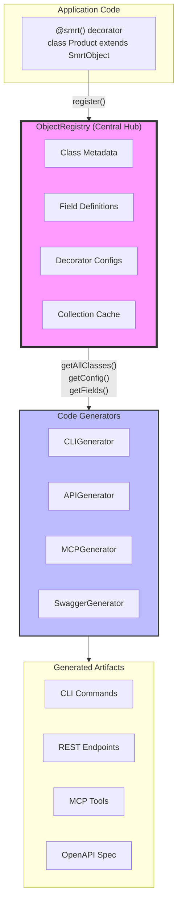

## Zero-Config CLI Discovery

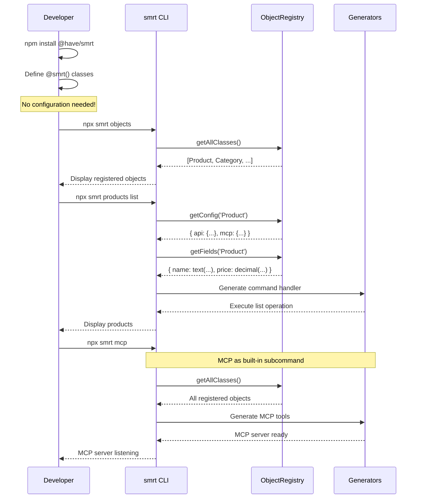

## Object Registration Flow

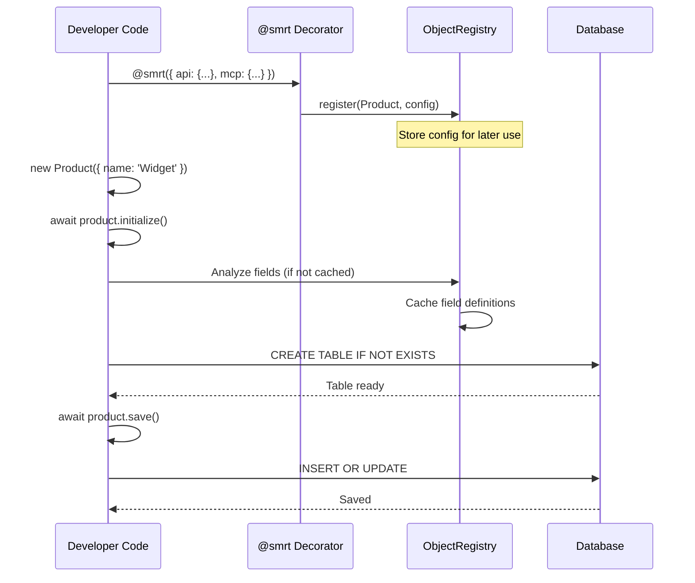

## Generator Execution Pattern

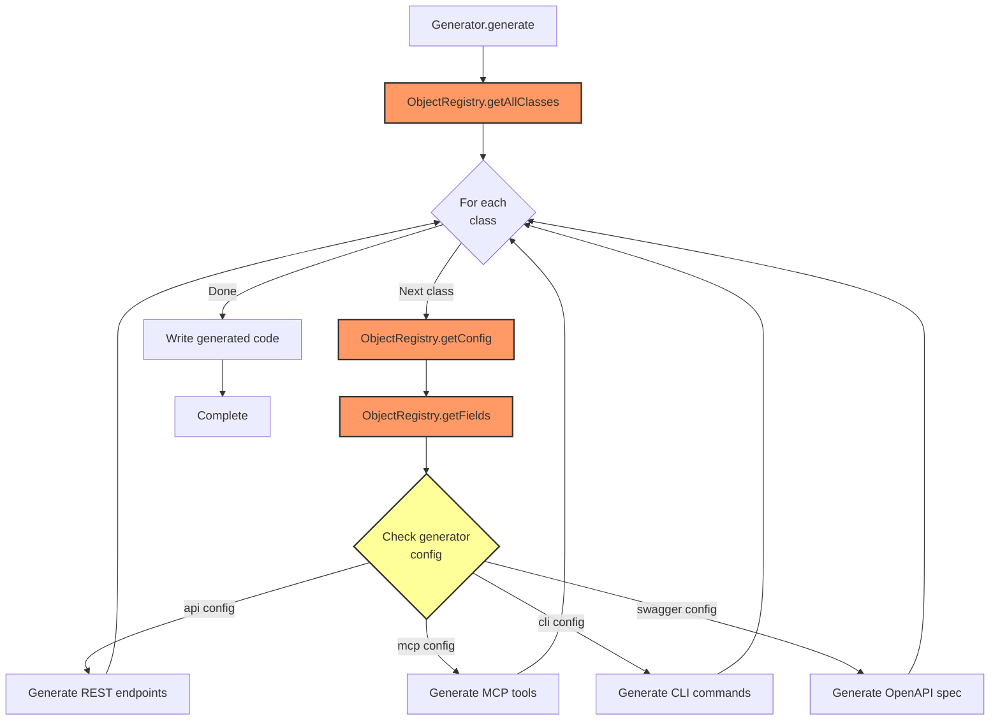

## Collection Singleton Pattern (Phase 4)

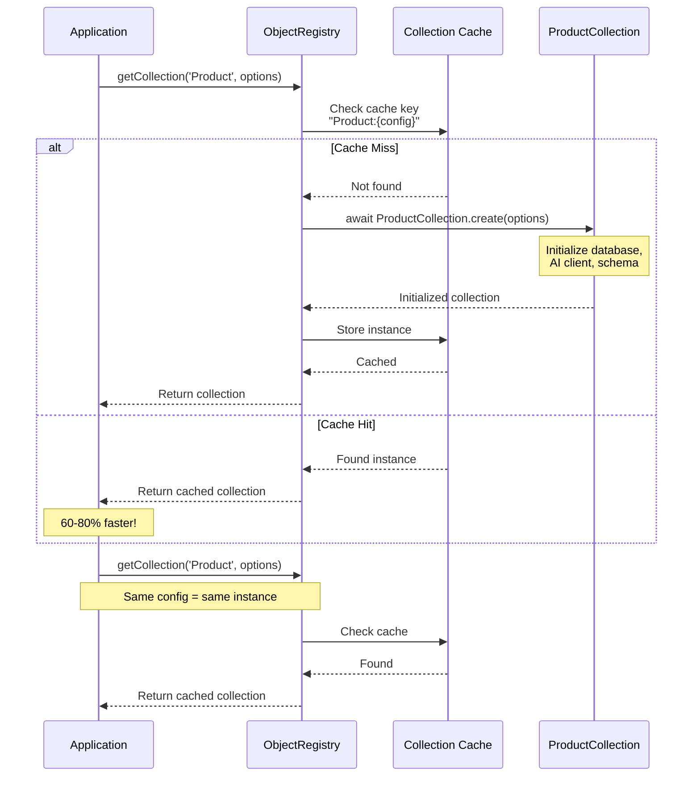

## Eager Loading Flow (Phase 5)

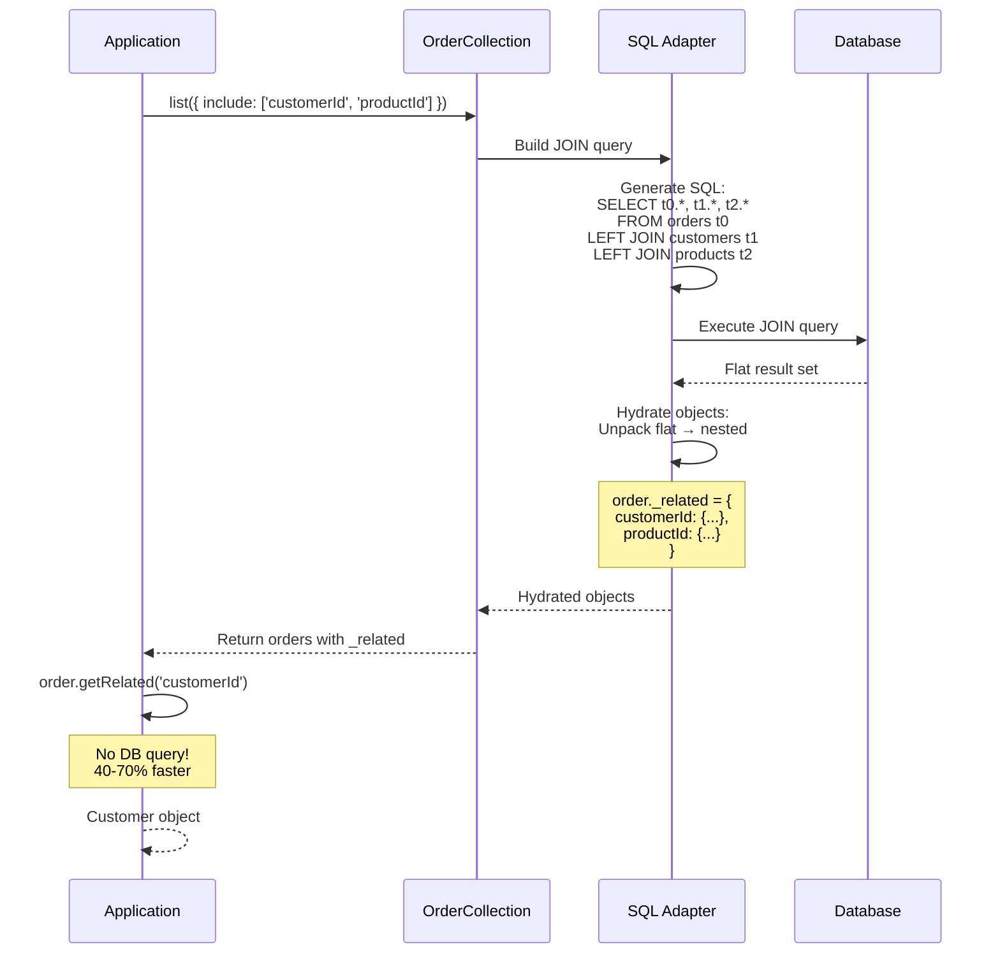

## Generator Consistency Pattern

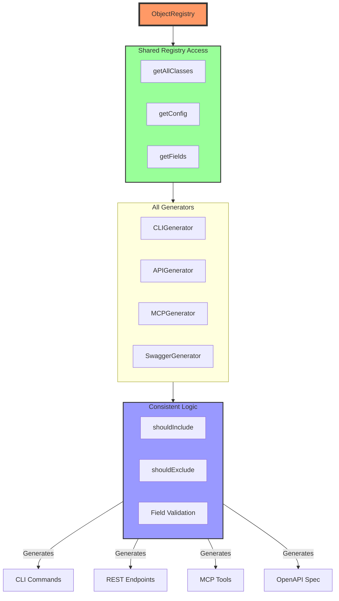

## Decorator Configuration Flow

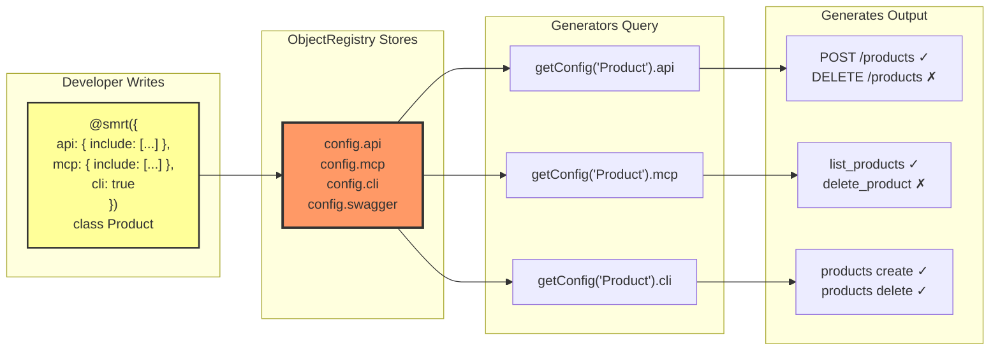

## CLI Command Structure

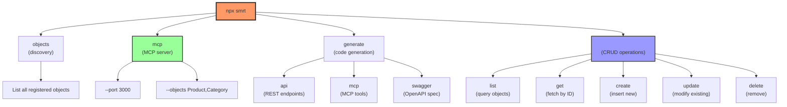

## Field Schema Consistency

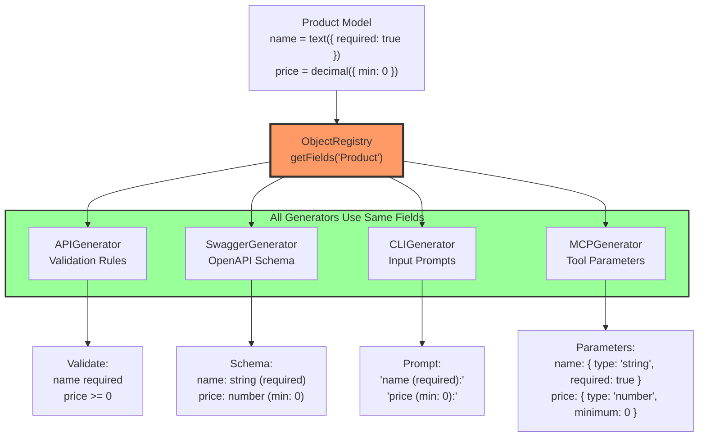

## Extension Points

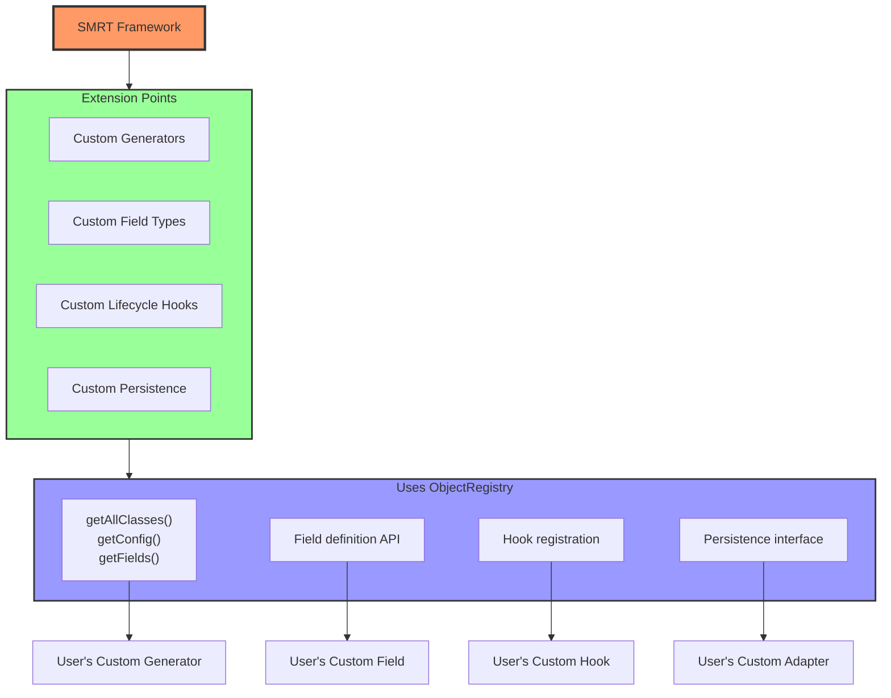

## Performance Optimization Stack

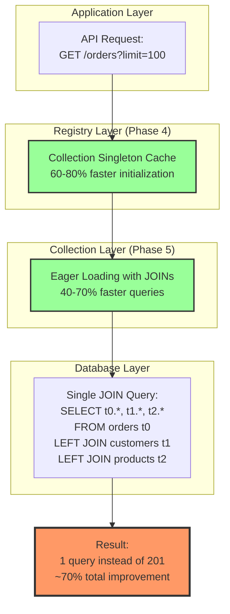

## Summary: Registry-Driven Architecture

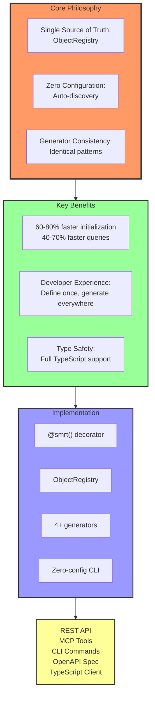
