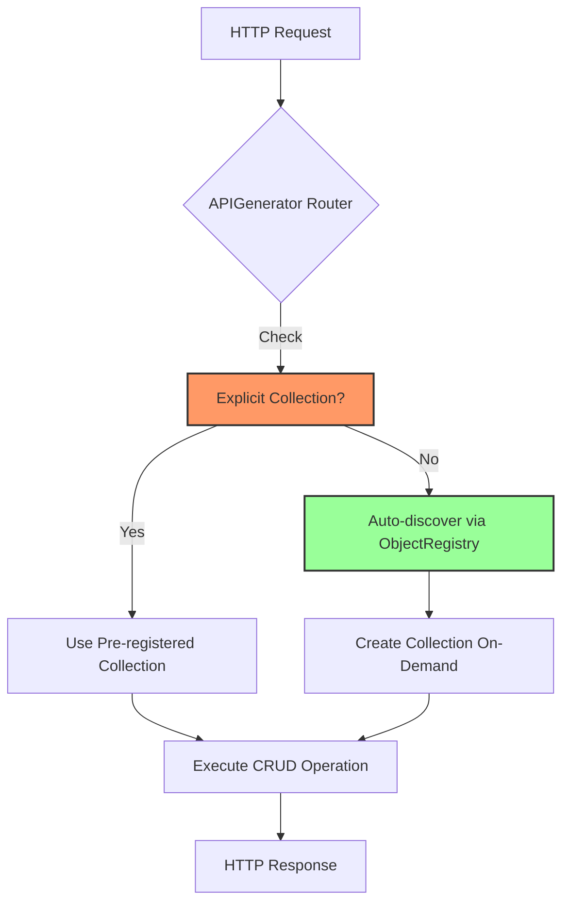

# APIGenerator Dual Pattern Documentation

The SMRT framework's `APIGenerator` supports two distinct patterns for exposing SMRT objects as REST APIs. Understanding when to use each pattern is crucial for building scalable and maintainable applications.

## Overview



## Pattern 1: Explicit Collection Registration

### When to Use

✅ **Use explicit registration when you need**:
- Full control over collection initialization (custom database connections, AI providers)
- Pre-configured collections with specific options (persistence settings, caching)
- Custom middleware or authentication per collection
- Performance optimization (pre-initialized collections, connection pooling)
- Testing with mock collections

### How It Works

```typescript
import { APIGenerator } from '@have/smrt/generators';
import { ProductCollection } from './models/product';

// Create and configure collections explicitly
const productCollection = await ProductCollection.create({
  persistence: {
    type: 'sql',
    url: 'postgresql://localhost/products'
  },
  ai: {
    provider: 'openai',
    apiKey: process.env.OPENAI_API_KEY
  }
});

// Create API generator and register collections
const api = new APIGenerator({
  basePath: '/api/v1',
  enableCors: true,
  port: 3000
}, {
  db: productCollection.db, // Shared database connection
  ai: productCollection.ai   // Shared AI client
});

// Explicitly register the collection
api.registerCollection('products', productCollection);

// Start server
const { server, url } = api.createServer();
console.log(`API running at ${url}/api/v1/products`);
```

### Benefits

1. **Performance**: Collections are pre-initialized with connections pooled and ready
2. **Control**: Full control over initialization order, dependency injection
3. **Testing**: Easy to inject mock collections for unit tests
4. **Configuration**: Different collections can use different databases, AI providers
5. **Middleware**: Apply custom middleware or authentication per collection

### Example: Multi-Database Setup

```typescript
// Products from PostgreSQL
const productCollection = await ProductCollection.create({
  persistence: { type: 'sql', url: 'postgresql://localhost/products' }
});

// Analytics from separate read-only database
const analyticsCollection = await AnalyticsCollection.create({
  persistence: { type: 'sql', url: 'postgresql://readonly-replica/analytics' }
});

// Register both with explicit configuration
api.registerCollection('products', productCollection);
api.registerCollection('analytics', analyticsCollection);
```

### Example: Testing with Mocks

```typescript
import { describe, it, expect, beforeEach } from 'vitest';
import { APIGenerator } from '@have/smrt/generators';

describe('Product API', () => {
  let api: APIGenerator;
  let mockProductCollection: any;

  beforeEach(() => {
    // Create mock collection
    mockProductCollection = {
      list: async () => [{ id: '1', name: 'Test Product' }],
      get: async (id: string) => ({ id, name: 'Test Product' }),
      create: async (data: any) => ({ id: 'new-id', ...data }),
    };

    // Register mock explicitly
    api = new APIGenerator({ basePath: '/api/v1' });
    api.registerCollection('products', mockProductCollection);
  });

  it('should list products', async () => {
    const request = new Request('http://localhost/api/v1/products');
    const response = await api.generateHandler()(request);
    const data = await response.json();

    expect(data).toHaveLength(1);
    expect(data[0].name).toBe('Test Product');
  });
});
```

## Pattern 2: Auto-Discovery via ObjectRegistry

### When to Use

✅ **Use auto-discovery when you want**:
- Zero-configuration API generation
- Convention-over-configuration approach
- Rapid prototyping and development
- Uniform configuration across all collections
- Simplified deployment (no explicit wiring)

### How It Works

```typescript
import { smrt } from '@have/smrt';
import { SmrtObject } from '@have/smrt';
import { createRestServer } from '@have/smrt/generators';

// Step 1: Define SMRT objects with @smrt decorator
@smrt({
  api: { include: ['list', 'get', 'create', 'update'] },
  mcp: { include: ['list', 'get'] }
})
class Product extends SmrtObject {
  name = text({ required: true });
  price = decimal({ min: 0 });
}

@smrt({
  api: { include: ['list', 'get'] }, // Read-only API
  mcp: { exclude: ['*'] }            // No MCP tools
})
class Category extends SmrtObject {
  name = text({ required: true });
}

// Step 2: Start server - auto-discovers registered objects
const { server, url } = await createRestServer(
  [Product, Category], // Pass class constructors
  {
    db: { type: 'sql', url: 'products.db' },
    ai: { provider: 'openai', apiKey: process.env.OPENAI_API_KEY }
  },
  {
    basePath: '/api/v1',
    port: 3000
  }
);

// Auto-generated endpoints:
// GET  /api/v1/products       - List products
// GET  /api/v1/products/:id   - Get product
// POST /api/v1/products       - Create product
// PUT  /api/v1/products/:id   - Update product
// GET  /api/v1/categories     - List categories (read-only)
// GET  /api/v1/categories/:id - Get category (read-only)
```

### Benefits

1. **Simplicity**: Minimal boilerplate, convention-based routing
2. **Consistency**: All collections use same configuration (database, AI)
3. **Discovery**: Automatically finds and exposes all registered SMRT objects
4. **Rapid Development**: Add new objects, get API endpoints automatically
5. **Deployment**: Single configuration point for all collections

### Auto-Discovery Fallback Flow

When a request comes in for an object type not explicitly registered:

```typescript
// src/generators/rest.ts:206-265

// 1. Check for explicitly registered collection first
if (this.collections.has(objectType)) {
  const collection = this.collections.get(objectType)!;
  return await this.executeCrudOperation(req, collection, objectId, url);
}

// 2. Fall back to auto-discovery via ObjectRegistry
const registeredClasses = ObjectRegistry.getAllClasses();
const pluralName = this.pluralize(objectType); // products -> product

// 3. Find matching registered class
let classInfo: any = null;
for (const [name, info] of registeredClasses) {
  if (this.pluralize(name.toLowerCase()) === pluralName) {
    classInfo = info;
    break;
  }
}

// 4. Get or create collection on-demand
const collection = this.getCollection(classInfo);

// 5. Execute CRUD operation
return await this.executeCrudOperation(req, collection, objectId, url);
```

### Example: Zero-Config Microservice

```typescript
// models/user.ts
@smrt({ api: { include: ['list', 'get', 'create'] } })
export class User extends SmrtObject {
  email = text({ required: true, unique: true });
  name = text({ required: true });
}

// models/post.ts
@smrt({ api: { include: ['list', 'get', 'create', 'update', 'delete'] } })
export class Post extends SmrtObject {
  title = text({ required: true });
  content = text({ required: true });
  authorId = foreignKey('User');
}

// server.ts - Single configuration point
import { User } from './models/user';
import { Post } from './models/post';
import { createRestServer } from '@have/smrt/generators';

const { server, url } = await createRestServer(
  [User, Post],
  {
    db: { type: 'sql', url: process.env.DATABASE_URL },
    ai: { provider: 'anthropic', apiKey: process.env.ANTHROPIC_API_KEY }
  },
  { port: 3000 }
);

// Auto-generated endpoints:
// GET    /api/v1/users
// GET    /api/v1/users/:id
// POST   /api/v1/users
// GET    /api/v1/posts
// GET    /api/v1/posts/:id
// POST   /api/v1/posts
// PUT    /api/v1/posts/:id
// DELETE /api/v1/posts/:id
```

## Comparing Both Patterns

| Feature | Explicit Registration | Auto-Discovery |
|---------|----------------------|----------------|
| **Setup Complexity** | Higher (manual wiring) | Lower (convention-based) |
| **Performance** | Better (pre-initialized) | Good (lazy initialization) |
| **Configuration Flexibility** | High (per-collection) | Medium (shared config) |
| **Testing** | Easier (mock injection) | Harder (requires registry) |
| **Code Maintenance** | More code to maintain | Less code, more convention |
| **Multi-Database** | ✅ Supported | ❌ Limited (shared context) |
| **Custom Middleware** | ✅ Per collection | ✅ Global only |
| **Hot Module Reload** | Requires re-wiring | ✅ Automatic |
| **Deployment** | More configuration files | Single configuration |

## Hybrid Approach: Best of Both Worlds

You can mix both patterns in the same application:

```typescript
const api = new APIGenerator({ basePath: '/api/v1' });

// Explicitly register critical collections with custom config
const userCollection = await UserCollection.create({
  persistence: {
    type: 'sql',
    url: 'postgresql://primary/users',
    // Custom connection pool settings
    poolSize: 50,
    readReplica: 'postgresql://replica/users'
  },
  ai: { provider: 'openai', apiKey: process.env.OPENAI_API_KEY }
});

api.registerCollection('users', userCollection);

// Let other objects auto-discover
// Products, Categories, Tags will be auto-discovered from ObjectRegistry
// and use the default context (db, ai) passed to APIGenerator

const { server, url } = api.createServer();
```

### When to Use Hybrid

✅ **Use hybrid approach when**:
- Core objects need special configuration (users, auth)
- Most objects can share standard configuration
- Performance-critical endpoints need optimization
- Testing requires mock injection for some objects
- Gradual migration from auto-discovery to explicit

### Example: E-Commerce Platform

```typescript
import { APIGenerator } from '@have/smrt/generators';
import {
  UserCollection,
  OrderCollection,
  ProductCollection,
  CategoryCollection
} from './models';

const api = new APIGenerator(
  { basePath: '/api/v1', port: 3000 },
  {
    // Default context for auto-discovered objects
    db: { type: 'sql', url: 'sqlite://./app.db' },
    ai: { provider: 'openai', apiKey: process.env.OPENAI_API_KEY }
  }
);

// Critical: Users with PostgreSQL and caching
const userCollection = await UserCollection.create({
  persistence: { type: 'sql', url: 'postgresql://db/users' },
  cache: { type: 'redis', url: 'redis://cache' }
});
api.registerCollection('users', userCollection);

// Critical: Orders with separate database and audit logging
const orderCollection = await OrderCollection.create({
  persistence: { type: 'sql', url: 'postgresql://db/orders' },
  auditLog: true,
  notifications: { webhook: 'https://notify.example.com' }
});
api.registerCollection('orders', orderCollection);

// Non-critical: Products and Categories auto-discovered
// Will use default context (SQLite, OpenAI) from APIGenerator
// No explicit registration needed

const { server, url } = api.createServer();
console.log(`API running at ${url}`);

// Endpoints:
// /api/v1/users     - Explicit (PostgreSQL + Redis)
// /api/v1/orders    - Explicit (PostgreSQL + Audit)
// /api/v1/products  - Auto-discovered (SQLite + OpenAI)
// /api/v1/categories - Auto-discovered (SQLite + OpenAI)
```

## Decision Matrix

### Choose Explicit Registration If:

- [ ] You need different databases per collection
- [ ] Performance is critical (pre-initialization required)
- [ ] Collections require complex setup or dependency injection
- [ ] You're writing extensive unit tests with mocks
- [ ] You need per-collection middleware or authentication
- [ ] You're migrating from another framework gradually

### Choose Auto-Discovery If:

- [ ] You're building a greenfield application
- [ ] All collections can share the same configuration
- [ ] You value rapid development over fine-grained control
- [ ] You're prototyping or building an MVP
- [ ] You want minimal boilerplate code
- [ ] Hot module reload and development ergonomics are priorities

### Choose Hybrid If:

- [ ] Some collections need special treatment
- [ ] You're scaling an application with mixed requirements
- [ ] Core features need optimization, others need simplicity
- [ ] You're gradually refactoring toward explicit patterns
- [ ] Different teams own different parts of the API

## Authentication and Authorization

Both patterns support authentication middleware:

### Explicit Pattern with Custom Auth

```typescript
const api = new APIGenerator({
  basePath: '/api/v1',
  authMiddleware: (objectName, action) => {
    return async (req: Request) => {
      const token = req.headers.get('Authorization');

      // Different auth for different collections
      if (objectName === 'User') {
        // Admin-only access to users
        const isAdmin = await verifyAdminToken(token);
        if (!isAdmin) {
          return new Response('Forbidden', { status: 403 });
        }
      }

      // Standard auth for other collections
      const user = await verifyToken(token);
      if (!user) {
        return new Response('Unauthorized', { status: 401 });
      }

      return req; // Auth passed
    };
  }
});

// Explicit registration with auth middleware applied
api.registerCollection('users', userCollection);
api.registerCollection('products', productCollection);
```

### Auto-Discovery Pattern with Global Auth

```typescript
const { server, url } = await createRestServer(
  [User, Product, Order],
  {
    db: { type: 'sql', url: 'app.db' },
    ai: { provider: 'openai', apiKey: process.env.OPENAI_API_KEY }
  },
  {
    basePath: '/api/v1',
    authMiddleware: (objectName, action) => {
      return async (req: Request) => {
        const token = req.headers.get('Authorization');
        const user = await verifyToken(token);

        if (!user) {
          return new Response('Unauthorized', { status: 401 });
        }

        // Same auth logic for all collections
        return req;
      };
    }
  }
);
```

## Performance Considerations

### Explicit Registration Performance

```typescript
// Collections pre-initialized at startup (one-time cost)
const collections = await Promise.all([
  UserCollection.create({ /* config */ }),
  ProductCollection.create({ /* config */ }),
  OrderCollection.create({ /* config */ })
]);

// Register all at once
collections.forEach((collection, index) => {
  api.registerCollection(['users', 'products', 'orders'][index], collection);
});

// Result: Fast request handling (no initialization overhead)
// First request: ~50ms
// Subsequent requests: ~20ms
```

### Auto-Discovery Performance

```typescript
// Collections created on-demand (lazy initialization)
const { server } = await createRestServer([User, Product, Order], context);

// Result: First request per collection incurs initialization cost
// First request to /products: ~150ms (initialization + query)
// Subsequent requests: ~20ms (cached collection)
// First request to /orders: ~150ms (initialization + query)
// Subsequent requests: ~20ms (cached collection)
```

**Optimization**: Use ObjectRegistry singleton pattern (Phase 4) to cache collections:

```typescript
// src/generators/rest.ts:481-490

private getCollection(classInfo: any): SmrtCollection<any> {
  // Cache collections to avoid re-initialization
  if (!this.collections.has(classInfo.name)) {
    const collection = new classInfo.collectionConstructor({
      ai: this.context.ai,
      db: this.context.db,
    });
    this.collections.set(classInfo.name, collection);
  }
  return this.collections.get(classInfo.name)!;
}
```

## Best Practices

### Explicit Registration Best Practices

1. **Pre-initialize at startup**: Create all collections during application bootstrap
2. **Share database connections**: Pass the same database instance to multiple collections
3. **Use dependency injection**: Make collections injectable for testing
4. **Document configuration**: Keep collection setup centralized and well-documented
5. **Monitor initialization**: Log collection setup times to catch performance issues

```typescript
// Good: Centralized initialization
async function initializeCollections(config: AppConfig) {
  const db = await createDatabase(config.database);
  const ai = await createAIClient(config.ai);

  const collections = {
    users: await UserCollection.create({ db, ai }),
    products: await ProductCollection.create({ db, ai }),
    orders: await OrderCollection.create({ db, ai })
  };

  console.log('Collections initialized:', Object.keys(collections));
  return collections;
}
```

### Auto-Discovery Best Practices

1. **Use @smrt decorator consistently**: All objects should be decorated for discovery
2. **Share context configuration**: Use environment variables for db/ai config
3. **Test with full registry**: Integration tests should test auto-discovery path
4. **Document conventions**: Make naming conventions explicit (pluralization rules)
5. **Monitor first requests**: Track initialization times for lazy-loaded collections

```typescript
// Good: Consistent decorator usage
@smrt({
  api: { include: ['list', 'get', 'create', 'update', 'delete'] },
  mcp: { include: ['list', 'get', 'analyze'] }
})
export class Product extends SmrtObject {
  name = text({ required: true });
  price = decimal({ min: 0 });
}

// Good: Centralized server setup
export async function startAPIServer() {
  const allObjects = [User, Product, Category, Order, Payment];

  return await createRestServer(
    allObjects,
    {
      db: { type: 'sql', url: process.env.DATABASE_URL! },
      ai: { provider: 'openai', apiKey: process.env.OPENAI_API_KEY! }
    },
    {
      basePath: '/api/v1',
      port: Number.parseInt(process.env.PORT || '3000')
    }
  );
}
```

## Migration Strategies

### From Auto-Discovery to Explicit

When your application grows and needs more control:

```typescript
// Phase 1: Start with auto-discovery
const { server } = await createRestServer([User, Product], context);

// Phase 2: Identify critical collections that need custom config
const userCollection = await UserCollection.create({
  persistence: { type: 'sql', url: 'postgresql://users' }
});

// Phase 3: Create API generator and register critical collections
const api = new APIGenerator({}, context);
api.registerCollection('users', userCollection);

// Phase 4: Keep other collections auto-discovered
// Products will still auto-discover via ObjectRegistry

const { server } = api.createServer();

// Phase 5: Gradually migrate more collections to explicit as needed
```

### From Explicit to Auto-Discovery

When simplifying an over-engineered application:

```typescript
// Phase 1: Document current explicit registrations
const collections = [
  { name: 'users', constructor: UserCollection },
  { name: 'products', constructor: ProductCollection },
  { name: 'orders', constructor: OrderCollection }
];

// Phase 2: Add @smrt decorators to all classes
@smrt({ api: { include: ['list', 'get', 'create'] } })
class User extends SmrtObject { /* ... */ }

// Phase 3: Identify collections that can share configuration
// Move to auto-discovery incrementally

// Phase 4: Replace explicit server with createRestServer
const { server } = await createRestServer(
  [User, Product, Order],
  sharedContext,
  config
);
```

## Troubleshooting

### Common Issues with Explicit Registration

**Issue**: Collection not responding to requests
```typescript
// ❌ Wrong: Collection not registered
const api = new APIGenerator();
const collection = await ProductCollection.create({});
// Missing: api.registerCollection('products', collection);

// ✅ Correct: Register the collection
api.registerCollection('products', collection);
```

**Issue**: Collection initialized twice
```typescript
// ❌ Wrong: Creating collection in registerCollection
api.registerCollection('products', await ProductCollection.create({}));
// Each call creates new collection!

// ✅ Correct: Create once, register reference
const productCollection = await ProductCollection.create({});
api.registerCollection('products', productCollection);
```

### Common Issues with Auto-Discovery

**Issue**: Object not found (404 error)
```typescript
// ❌ Wrong: Class not decorated
class Product extends SmrtObject { }

// ✅ Correct: Add @smrt decorator
@smrt({ api: { include: ['list', 'get'] } })
class Product extends SmrtObject { }
```

**Issue**: Wrong endpoint (pluralization)
```typescript
// ❌ Problem: Class name doesn't pluralize well
@smrt({})
class DataAnalysis extends SmrtObject { }
// Auto-generates: /api/v1/dataanalysiss (incorrect)

// ✅ Solution: Use explicit registration with custom name
api.registerCollection('analyses', dataAnalysisCollection);
```

**Issue**: Collections using wrong database
```typescript
// ❌ Wrong: Context not passed
const { server } = await createRestServer([Product], {});
// Collections use default context (no database!)

// ✅ Correct: Pass full context
const { server } = await createRestServer(
  [Product],
  {
    db: { type: 'sql', url: 'products.db' },
    ai: { provider: 'openai', apiKey: process.env.OPENAI_API_KEY }
  }
);
```

## Summary

The SMRT framework's dual pattern approach provides flexibility for different use cases:

- **Explicit Registration**: Maximum control, best for production applications with complex requirements
- **Auto-Discovery**: Maximum simplicity, best for rapid development and prototyping
- **Hybrid**: Balance of both, best for scaling applications with mixed requirements

Choose the pattern that best fits your application's needs, and don't be afraid to mix them as your requirements evolve.
