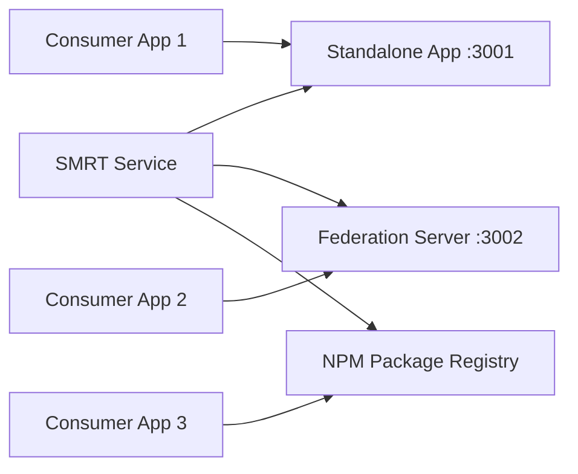

# Deployment Modes Guide

## Overview

The SMRT template supports multiple deployment modes to fit different architectural needs and organizational requirements. Each mode serves different use cases while maintaining the same underlying codebase.

## Mode 1: Standalone Application 🏗️

Deploy as a complete, independent web application.

### Use Cases
- **Microservice per team** - Each team owns their complete application
- **MVP development** - Quick deployment of focused functionality  
- **Legacy replacement** - Drop-in replacement for existing applications
- **Development/testing** - Isolated testing environment

### Deployment

#### Local Development
```bash
npm run dev:standalone
# Available at: http://localhost:3001
```

#### Production Build
```bash
npm run build:app
# Generates: dist/app/
```

#### Docker Deployment
```dockerfile
FROM node:22-alpine
WORKDIR /app
COPY dist/app .
RUN npm install -g serve
EXPOSE 3001
CMD ["serve", "-s", ".", "-l", "3001"]
```

#### Kubernetes Deployment
```yaml
apiVersion: apps/v1
kind: Deployment
metadata:
  name: product-service
spec:
  replicas: 3
  selector:
    matchLabels:
      app: product-service
  template:
    metadata:
      labels:
        app: product-service
    spec:
      containers:
      - name: product-service
        image: product-service:latest
        ports:
        - containerPort: 3001
---
apiVersion: v1
kind: Service
metadata:
  name: product-service
spec:
  selector:
    app: product-service
  ports:
  - port: 80
    targetPort: 3001
  type: LoadBalancer
```

### Configuration
```bash
# Environment variables
VITE_API_BASE_URL=https://api.mycompany.com
VITE_SERVICE_NAME=product-service
VITE_FEDERATION_DISABLED=true
```

## Mode 2: Module Federation Provider 🔗

Deploy as a federation server that exposes components for other applications.

### Use Cases
- **Micro-frontend architecture** - Share components across applications
- **Component library distribution** - Runtime component sharing
- **Service composition** - Build applications from federated services
- **Progressive enhancement** - Optional feature loading

### Deployment

#### Local Development
```bash
npm run dev:federation
# Federation server: http://localhost:3002
# remoteEntry.js: http://localhost:3002/assets/remoteEntry.js
```

#### Production Build  
```bash
npm run build:federation
# Generates: dist/federation/
```

#### Docker Deployment
```dockerfile
FROM nginx:alpine
COPY dist/federation /usr/share/nginx/html

# Custom nginx config for federation
COPY <<EOF /etc/nginx/nginx.conf
events {}
http {
  include       /etc/nginx/mime.types;
  default_type  application/octet-stream;
  
  server {
    listen 80;
    
    location / {
      root /usr/share/nginx/html;
      try_files \$uri \$uri/ /index.html;
      
      # CORS headers for federation
      add_header 'Access-Control-Allow-Origin' '*';
      add_header 'Access-Control-Allow-Methods' 'GET, POST, OPTIONS';
      add_header 'Access-Control-Allow-Headers' 'DNT,User-Agent,X-Requested-With,If-Modified-Since,Cache-Control,Content-Type,Range';
    }
    
    # Special handling for remoteEntry.js
    location ~* remoteEntry\.js$ {
      add_header Cache-Control 'no-cache, no-store, must-revalidate';
      add_header 'Access-Control-Allow-Origin' '*';
    }
  }
}
EOF

EXPOSE 80
```

#### CDN Distribution
```bash
# Upload federation assets to CDN
aws s3 sync dist/federation/ s3://my-federation-cdn/product-service/

# Update DNS
# product-service-federation.mycompany.com -> CDN URL
```

### Configuration
```bash
# Environment variables
VITE_FEDERATION_NAME=productService
VITE_FEDERATION_PORT=3002
VITE_CDN_BASE_URL=https://cdn.mycompany.com/product-service/
```

## Mode 3: NPM Package Library 📦

Publish as a traditional NPM package for build-time consumption.

### Use Cases
- **Build-time optimization** - Better tree-shaking and bundling
- **Offline development** - No runtime dependencies on external services
- **Library distribution** - Traditional package manager workflow
- **Type safety** - Full TypeScript support in consuming projects

### Deployment

#### Build Library
```bash
npm run build:lib
# Generates: dist/lib/
```

#### NPM Publishing
```bash
# Update version
npm version patch

# Publish to NPM
npm publish

# Or publish to private registry
npm publish --registry https://npm.mycompany.com
```

#### GitHub Packages
```yaml
# .github/workflows/publish.yml
name: Publish Package
on:
  release:
    types: [published]

jobs:
  publish:
    runs-on: ubuntu-latest
    steps:
    - uses: actions/checkout@v3
    - uses: actions/setup-node@v3
      with:
        node-version: '22'
        registry-url: 'https://npm.pkg.github.com'
    
    - run: npm ci
    - run: npm run build:lib
    - run: npm publish
      env:
        NODE_AUTH_TOKEN: ${{ secrets.GITHUB_TOKEN }}
```

### Usage in Consumer Projects
```bash
# Install the package
npm install @mycompany/product-service

# Or specific version
npm install @mycompany/product-service@1.2.3
```

```typescript
// Import what you need
import { Product, Category } from '@mycompany/product-service';
import { ProductCard, ProductForm } from '@mycompany/product-service/components';
import { productStore } from '@mycompany/product-service/stores';

// Use in your application
const product = new Product({ name: 'Test Product' });
<ProductCard {product} />
```

## Mode 4: Hybrid Deployment 🚀

Deploy multiple modes simultaneously from the same service.

### Use Cases
- **Maximum flexibility** - Support different consumption patterns
- **Migration strategy** - Gradual transition between patterns
- **Development efficiency** - Test all patterns from one service
- **Organization choice** - Let consumers pick their preferred pattern

### Deployment Architecture



#### Docker Compose
```yaml
version: '3.8'
services:
  # Standalone application
  product-app:
    build: .
    command: npm run start:standalone
    ports:
      - "3001:3001"
    environment:
      - NODE_ENV=production
  
  # Federation server
  product-federation:
    build: .
    command: npm run start:federation  
    ports:
      - "3002:3002"
    environment:
      - NODE_ENV=production
      - FEDERATION_MODE=true
  
  # Nginx reverse proxy
  nginx:
    image: nginx:alpine
    ports:
      - "80:80"
    volumes:
      - ./nginx.conf:/etc/nginx/nginx.conf
```

#### Nginx Configuration
```nginx
server {
    listen 80;
    server_name product-service.mycompany.com;
    
    # Standalone application
    location / {
        proxy_pass http://product-app:3001;
    }
    
    # Federation endpoint
    location /federation/ {
        proxy_pass http://product-federation:3002/;
        
        # CORS for federation
        add_header 'Access-Control-Allow-Origin' '*';
        add_header 'Access-Control-Allow-Methods' 'GET, POST, OPTIONS';
    }
    
    # Health checks
    location /health {
        access_log off;
        return 200 "healthy\n";
    }
}
```

### Build Script
```bash
#!/bin/bash
# build-all.sh

echo "Building all deployment modes..."

# Clean previous builds
rm -rf dist/

# Build all modes
npm run build:lib        # NPM package
npm run build:app        # Standalone app
npm run build:federation # Federation server

# Package for different deployments
tar -czf standalone.tar.gz -C dist/app .
tar -czf federation.tar.gz -C dist/federation .
tar -czf library.tar.gz -C dist/lib .

echo "All builds complete!"
echo "- standalone.tar.gz (deploy to app server)"
echo "- federation.tar.gz (deploy to CDN/federation server)"  
echo "- library.tar.gz (publish to NPM)"
```

## Environment Configuration

### Development
```bash
# .env.development
VITE_MODE=development
VITE_API_BASE_URL=http://localhost:8080
VITE_ENABLE_FEDERATION=true
VITE_ENABLE_MOCK_DATA=true
```

### Staging
```bash
# .env.staging  
VITE_MODE=staging
VITE_API_BASE_URL=https://api-staging.mycompany.com
VITE_ENABLE_FEDERATION=true
VITE_ENABLE_ANALYTICS=false
```

### Production
```bash
# .env.production
VITE_MODE=production
VITE_API_BASE_URL=https://api.mycompany.com
VITE_ENABLE_FEDERATION=true
VITE_ENABLE_ANALYTICS=true
VITE_CDN_BASE_URL=https://cdn.mycompany.com
```

## Monitoring and Observability

### Health Checks
```typescript
// src/lib/utils/health.ts
export async function getHealthStatus() {
  return {
    mode: process.env.VITE_MODE,
    timestamp: new Date().toISOString(),
    version: process.env.npm_package_version,
    features: {
      standalone: process.env.VITE_ENABLE_STANDALONE !== 'false',
      federation: process.env.VITE_ENABLE_FEDERATION === 'true',
      analytics: process.env.VITE_ENABLE_ANALYTICS === 'true'
    }
  };
}
```

### Metrics Collection
```typescript
// Track usage patterns across deployment modes
export function trackDeploymentMode(mode: string) {
  // Send to analytics service
  analytics.track('deployment_mode_used', { mode });
}
```

### Logging Strategy
```typescript
// Different logging for different modes
const logger = createLogger({
  level: process.env.VITE_MODE === 'production' ? 'warn' : 'debug',
  format: process.env.VITE_MODE === 'production' ? 'json' : 'simple',
  metadata: {
    service: 'product-service',
    mode: process.env.VITE_DEPLOYMENT_MODE,
    version: process.env.npm_package_version
  }
});
```

## Migration Strategies

### From Monolith to Microservices
1. **Start with standalone** - Replace monolith sections
2. **Add federation** - Share components across new microservices  
3. **Publish packages** - Enable build-time optimization

### From Traditional SPA to Micro-Frontends
1. **Build as NPM packages** - Maintain current build process
2. **Add federation capability** - Enable runtime composition
3. **Migrate consumers** - Gradual adoption of federation

### From Static Libraries to Runtime Services
1. **Package existing code** - Publish as NPM packages
2. **Add service wrapper** - Create standalone applications
3. **Enable federation** - Allow runtime consumption

Each deployment mode serves specific architectural needs while maintaining the benefits of a single, well-tested codebase. Choose the mode that best fits your current requirements, with the flexibility to adopt other modes as needs evolve.